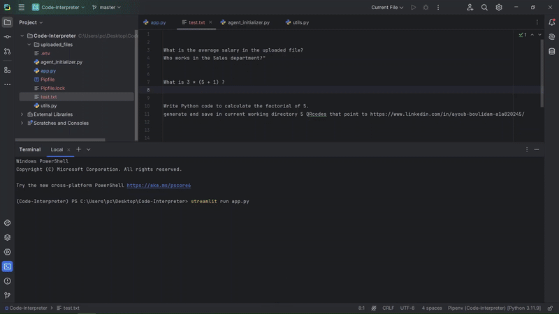

# AgentXpert

**AgentXpert** is a lean, specialized chatbot that integrates multiple agents for handling specific tasks. These agents can execute Python code, solve mathematical problems, and analyze CSV files. It provides a simple and functional interface, ideal for targeted, task-based interactions.


### Demo

Here’s a quick look at AgentXpert in action:

<p align="center">
  
</p>


## Features

### Specialized Agents
- **Python Agent**: Executes Python code for complex calculations or other Python-related tasks.
- **Math Agent**: Solves mathematical problems or equations.
- **CSV Agent**: Analyzes CSV files using Python and the pandas library.

### Simple Interface
- **Streamlit-based Web Interface**: A frontend built using Streamlit that allows users to interact via text input and file uploads.
- **File Upload Support**: Users can upload CSV files, and the chatbot will process queries related to those files.
- **Chat History**: Maintains a history of user-agent conversations for easy reference.

## How It Works

1. **User Input**: The user types a question or query in the text input box.
2. **Agent Routing**: The chatbot routes the query to the appropriate agent:
   - **Math queries** (e.g., "What is 5 + 3?") go to the **Math Agent**.
   - **Python code execution** queries go to the **Python Agent**.
   - **CSV file analysis** queries (e.g., "What is the sum of column A?") go to the **CSV Agent**.
3. **Agent Response**: Each agent processes the query and returns a response, which is displayed to the user in the chat interface.
4. **CSV File Handling**: If the query involves CSV analysis, users can upload a file, and the chatbot will analyze the data using pandas.

## Requirements

To run the project locally, install the following dependencies:

```bash
pip install -r requirements.txt
```

- **LangChain**: For creating and managing the specialized agents.
- **Streamlit**: For the frontend interface.
- **dotenv**: For environment variable management.
- **pandas**: For handling CSV files.
- **langchain_google_genai**: For integrating Google's Gemini model.

## File Structure

```
AgentXpert/
│
├── app.py                 # Main Streamlit app script
├── agent_initializer.py   # Script to initialize the grand agent and its components
├── utils.py               # Utility functions for handling file uploads
├── uploaded_files/        # Directory where uploaded CSV files are stored
├── requirements.txt       # Project dependencies
├── .env                   # Environment variables for configuration
```

## How to Use

1. **Start the Application**:
   Run the Streamlit application with the following command:

   ```bash
   streamlit run app.py
   ```

2. **Interacting with the Chatbot**:
   - **Enter a question** in the text input box (e.g., "What is 7 + 9?").
   - **Upload a CSV file** if needed for data analysis.
   - The chatbot will route your query to the appropriate agent and display the response.

3. **See Results**:
   - The chatbot will return the result of your query, whether it's the solution to a math problem, the output of a Python script, or a CSV analysis.

## Example Usage

- **Math Query**:
   - User: "What is 7 + 9?"
   - AgentXpert: "16"

- **Python Query**:
   - User: "Generate a QR code for the text 'Hello, AgentXpert!'"
   - AgentXpert: The QR code for the text is generated .

- **CSV Analysis**:
   - User: "What is the sum of column 'A' in the uploaded CSV?"
   - AgentXpert: "The sum of column 'A' is 123."

## Contributing

Feel free to contribute to the **AgentXpert** project by opening issues or submitting pull requests. Your feedback and improvements are always welcome!


